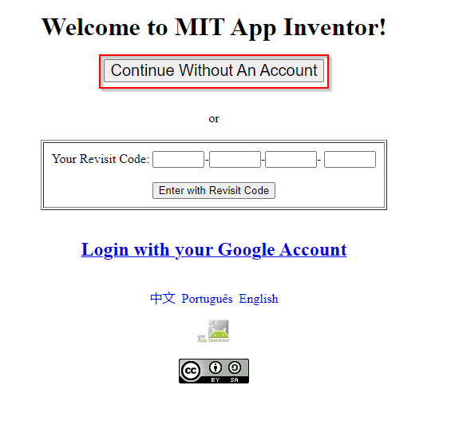
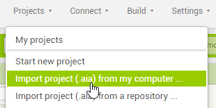
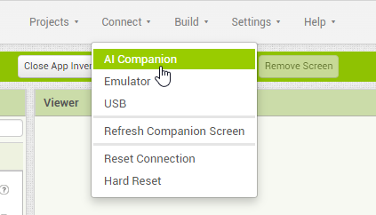
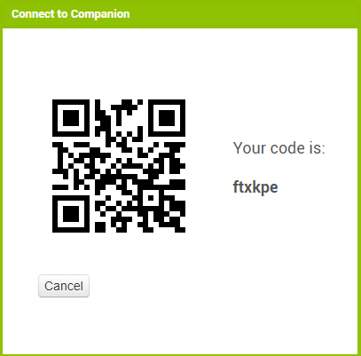
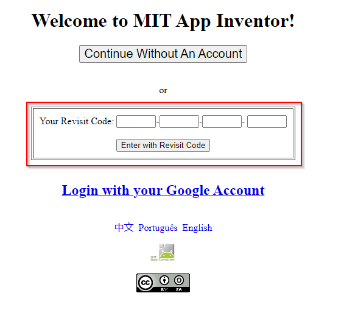

# MIT App Inventor

`MIT App Inventor` ist eine intuitive, visuelle Programmierumgebung, die es jedem ermöglicht, voll funktionsfähige Apps für Android Smartphones oder Tablets in weniger als 30 Minuten zu erstellen. Wir haben das Tool verwendet, um das Auto über ein Tablet zu steuern.

## MIT App Inventor Code

Im Unterordner `appfiles` findet ihr aktuell 2 Dateien: `hack-week-car.aia`, `hack-week-car-alternative.aia`. `hack-week-car.aia` enthält code für eine Multi-Touch Steuerung für die Geschwindigkeit und Lenkung und ist ein guter Startpunkt.

1. Gehe zum MIT App Inventor über diesen [Link](http://code.appinventor.mit.edu/), damit du kein Konto anlegen musst.

    

2. Bei der Anmeldung wird dir ein Rückgabecode angezeigt - kopiere und speichere diesen Code an einem sicheren Ort, da dein Projekt ohne den Code nach einmaliger Abmeldung eventuell nicht mehr abgerufen werden kann:

    

3. Erstelle ein neues Projekt und importieren die .aia Dateien aus dem Unterordner `appfiles`:

    

    

4. Stelle eine Verbindung zu einem Android-Tablet oder Smartphone her, indem du auf `Connect > AI Companion` clickst. Dann wird ein QR-Code erstellt den du mit deinem Endgerät scannen musst: 

    

    

    Super! Jetzt hast du eine Verbindung zwischem dem Gerät mit dem Auto hergestellt und kannst es steuern. Außerdem, kannst du alle Projektänderungen als Vorschau auf dem Endgerät sehen. Wenn du die App auf dem Gerät schließen, wird Ihre Verbindung zum Auto und zum Projekt unterbrochen. Wenn du die Verbindung verlieren solltest, generiere einen neuen QR-Code und verbinde dich erneut.

5. Wenn du dich abmeldest und am nächsten Tag weiterarbeiten willst, gebe den ursprünglichen Rückgabecode ein, um dich erneut anzumelden:

    

## Microcontroller Code

Im Verzeichnis `arduino\hack-week-car` findet ihr den Quellcode welcher die Nachrichten vom App-Inventor erhält und in die Steuerung umsetzt.