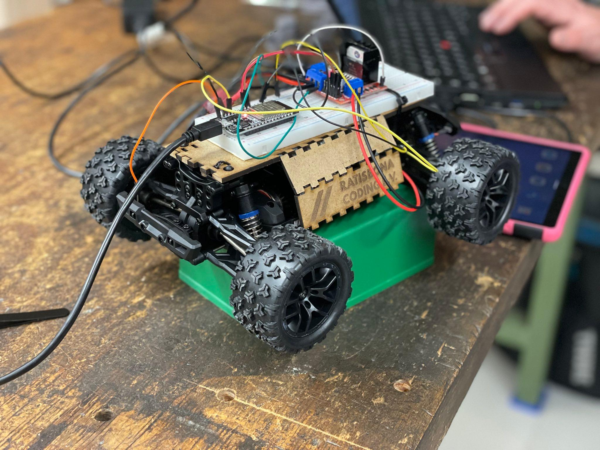
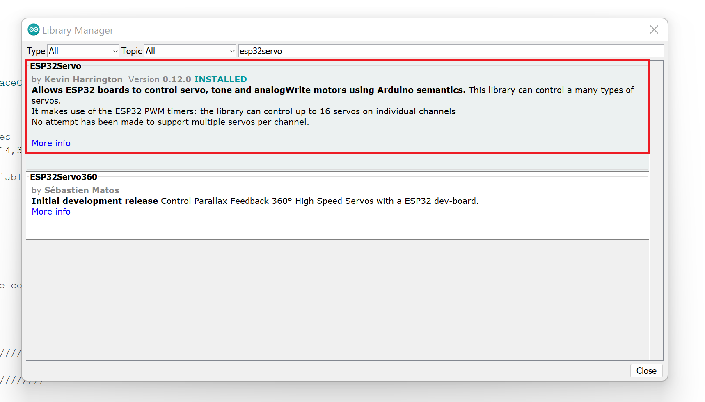
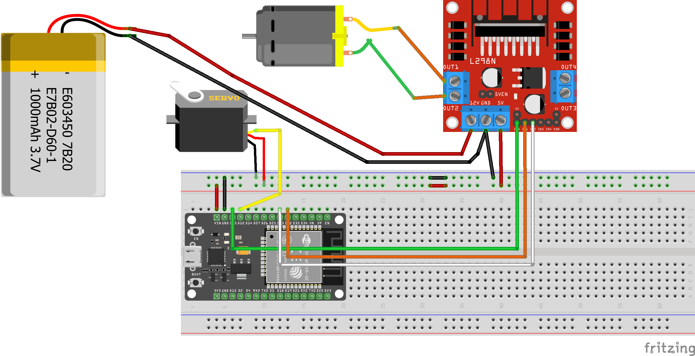
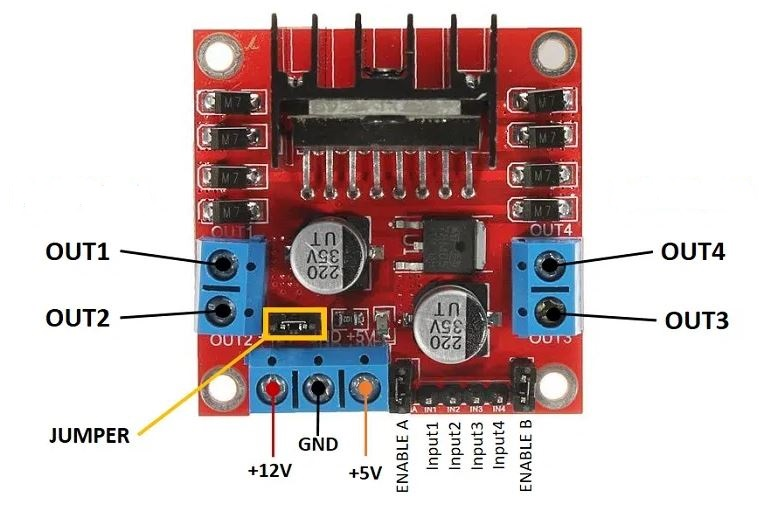

# MINT-Labs Hackweek

Dieses Repository enthält den Quellcode für das Auto, das wir bei der [MINT-Labs Hackweek][Veranstaltung] verwenden möchten. Das Ziel der Veranstaltung wird es sein, den vorinstallierten RC-Car-Receiver und Geschwindigkeitsregler durch ein ESP32 und einen benutzerdefinierten Geschwindigkeitsregler zu ersetzen, um weitere Anpassungen ermöglichen zu können. Außerdem, wird somit möglich, das Auto von einem Tablet oder Smartphone über Bluetooth aus zu steuern.

[Veranstaltung]: https://www.mint-labs-regensburg.de/course/10059/hack-week-sponsored-by-bmw.html

## Repository Aufbau

Hier findet ihr die Beschreibung, wie ihr eure Entwicklungsumgebung aufsetzen müsst und wie das Hardware-Setup grundsätzlich geht. Im Ordner `RemoteXY` findet ihr eine Beschreibung, wie eine Steuerung für das Auto in RemoteXY erstellt und als Code herunterladen kann, sowie ein fertiges Beispiel. Als Alternative, findet ihr in dem `MIT App Inventor` Ordner eine Beschreibung und fertige Codes für die Steuerung des Autos über MIT App Inventor.

## Entwicklungsumgebung

### Arduino Studio 1.8.19

Hier herunterladen https://downloads.arduino.cc/arduino-1.8.19-windows.exe und installieren.

### ESP32 Board

Dann müssen wir die board library für das ESP32 board installieren:

* `File > Preferences > Additional Board Manager Urls`: https://raw.githubusercontent.com/espressif/arduino-esp32/gh-pages/package_esp32_index.json eintragen
* `Tools > Board > Board Manager` suchen nach ESP32 und installieren

### ESPServo Bibliothek

* `Sketch > Include Library > Manage Libraries` suche nach `esp32Servo` und dann installieren (nicht esp32servo360).

    

## Hardware-Setup & Schema

| L298N Motor Driver  | ESP32 | Funktion |
| ------------- | ------------- | ------------- |
| 5 v   | VIN	| Spannungsversorgung (+) |
| ENA	| D12	| Geschwindingkeit |
| IN1	| D32	| Drehrichtung 1 |
| IN2	| D33	| Drehrichtung 2 |
| GND	| GND	| Spannungsversorgung (-) |

| Servo  | ESP32 | Funktion |
| ------------- | ------------- | ------------- |
| Braun  | GND  | Spannungsversorgung (-) |
| Rot	| VIN	| Spannungsversorgung (+) |
| Gelb	| D12	| Lenkeinschlag |

## Appendix

### ESP32 Pinout

[Quelle](https://microcontrollerslab.com/esp32-pinout-use-gpio-pins/)

### L298N Motortreiber

Der L298N Motortreiber ist ein Controller, der eine H-Brücke verwendet, der die Richtung und Geschwindigkeit von bis zu 2 Gleichstrommotoren steuern kann. Die Motorsteuerung L298N hat insgesamt 14 Pins mit verschiedenen Funktionen.

[Quelle](https://components101.com/modules/l293n-motor-driver-module)

