# Projekt erstellen

Bei diesem Beispiel zeigen wir euch, wie man eine LED am Fahrzeug über eine Handy App steuern kann.

## LEDs verkabeln

Öffnet den Schrumpfschlauch vorsichtig beim LED Anschluss und verbindet die Kabel mit zwei Dupont Kabeln.

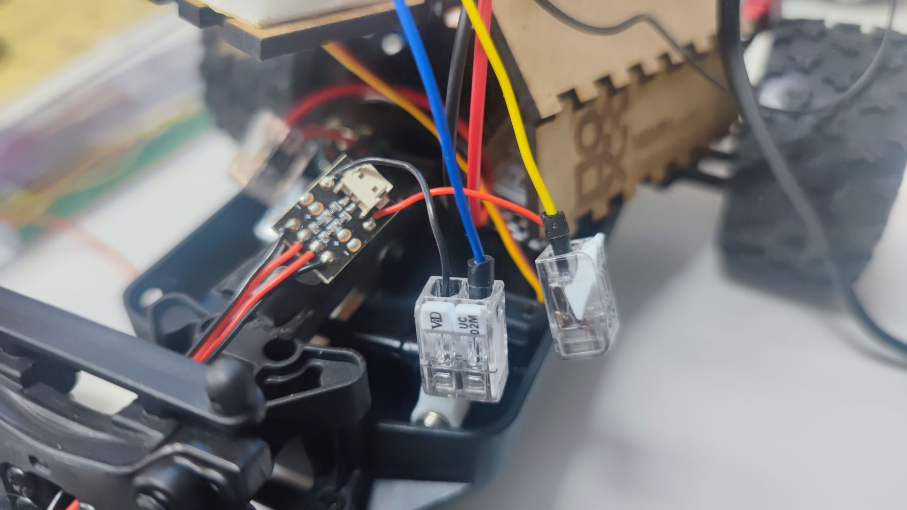

Dann baut auf dem Breadboard eine Schaltung nach dieser Vorlage auf:

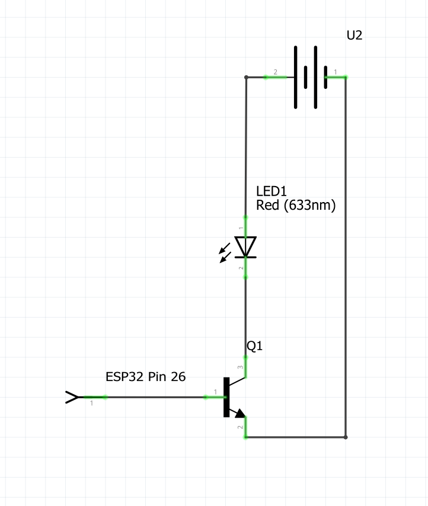

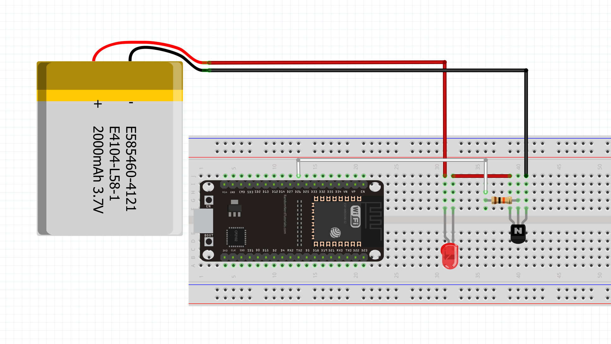

## GUI mit RemoteXY erstellen

1. Folge diesem [Link](https://remotexy.com/en/editor/) und klicke oben recht kannst du auf `Editor`.

    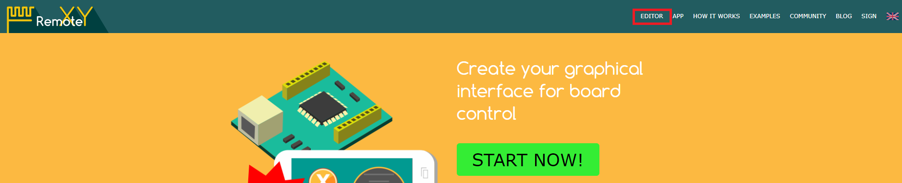

2. Rechts bei `Properties` öffne `Configuration`: 

    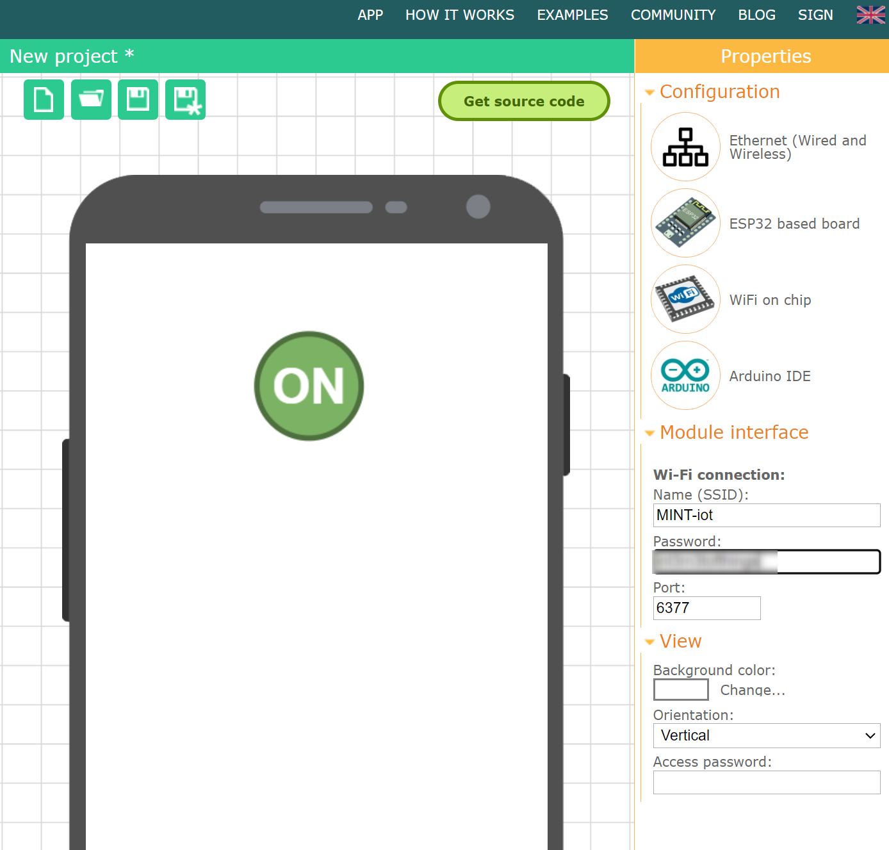

    Wähle eins der Elemente an und es wird ein Pop-up erscheinen. Wähle die Verbindung, Board und Modul wie unten aufgelistet und bestätige deine Auswahl:

      * Connection: Ethernet (Wired and Wireless)
      * Board: ESP32 based board
      * Module: WiFi on chip
      * IDE: Arduino IDE

    WiFi connection Zugangsdaten
    
      * MINT-iot
      * Passwort steht an der Tafel

3. Auf der linken Seite bei Elements klappe `Controls` auf und ziehe einen `Push Switch` in die GUI.

    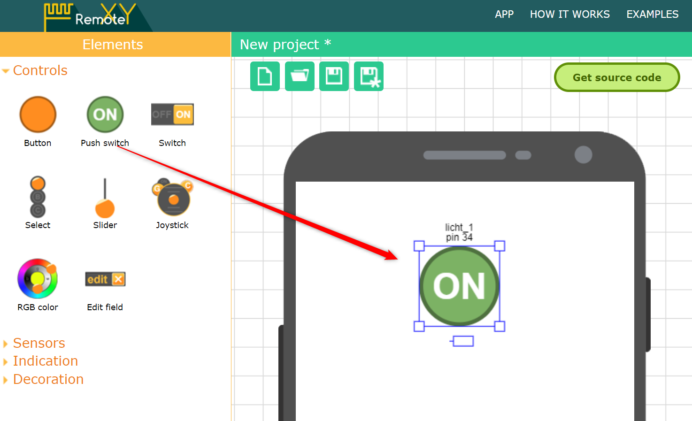

4. Gib dem Button den Namen `licht_1` und wähle unter `Snap to PIN` den Pin 26 aus.

    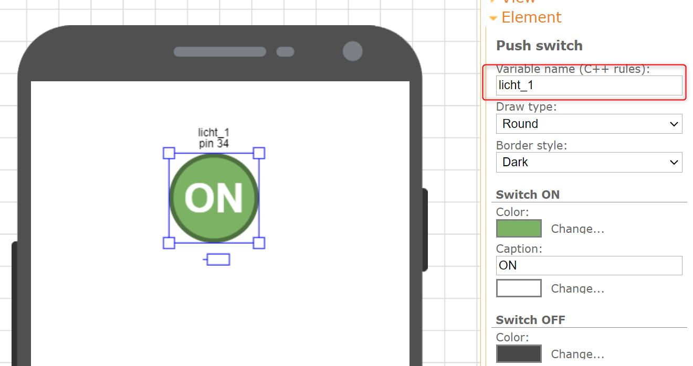

5. Mit dem Button `Get source code` kannst Du Dir den Quellcode holen. Kopiere diesen in Deine `Arduino IDE`

    </img>

    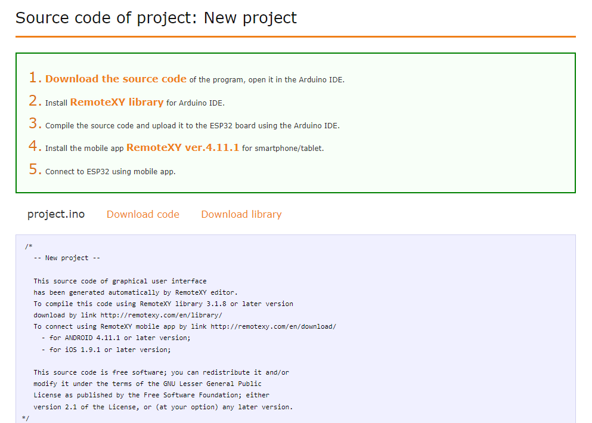

## Microcontroller programmieren

Jetzt müssen wir das programm etwas erweitern und übertragen es auf unseren Microcontroller.

### IP Adresse anzeigen

Nachdem wir in diesem Beispiel das Auto über WiFi steuern wollen, brauchen wir die IP Adresse (Sowas wie seine Hausnummer im Netzwerk) des Microcontrollers. Diese können wir uns mit ein paar Zeilen Code ausgeben lassen.

Vorher
```C++
void setup() 
{
  RemoteXY_Init (); 
}
```

Nachher
```C++
void setup() 
{
  RemoteXY_Init (); 
  // Gib die IP Adresse aus
  Serial.begin(115200);
  Serial.print("Connecting to ");
  Serial.println(REMOTEXY_WIFI_SSID);
  while (WiFi.status() != WL_CONNECTED) {
    delay(500);
    Serial.print(".");
  }
  Serial.println("");
  Serial.println("WiFi connected.");
  Serial.println("IP address: ");
  Serial.println(WiFi.localIP()); 
}
```

### Programm übertragen

Jetzt bitte kompilieren und auf den ESP übertragen. Klick auf Button Upload und wenn eine Meldung Connecting.... kommt, den Knopf rechts vom USB Anschluss auf dem ESP drücken, bis die Übertragung beginnt.

Auf dem Seriellen Monitor gibt der Microcontroller seine IP Adresse aus. Dafür öffnet ihr in der Arduino IDE `Tools -> Serial Monitor` - Vergesst nicht unten rechts die Baud Rate auf 115200 zu stellen, sollte nur Quatsch da stehen.

Die Ausgabe sollte wie folgt aussehen:

```
...
load:0x40080400,len:3036
entry 0x400805e4
Connecting to MINT-iot
.
WiFi connected.
IP address: 
192.168.178.244
```

`192.168.178.244` wäre dann eure IP Adresse

## RemoteXY App

Verbindet die App mit dem Microcontroller

Klick auf das +

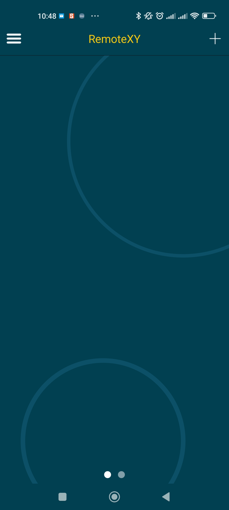

Wähle `Ethernet`

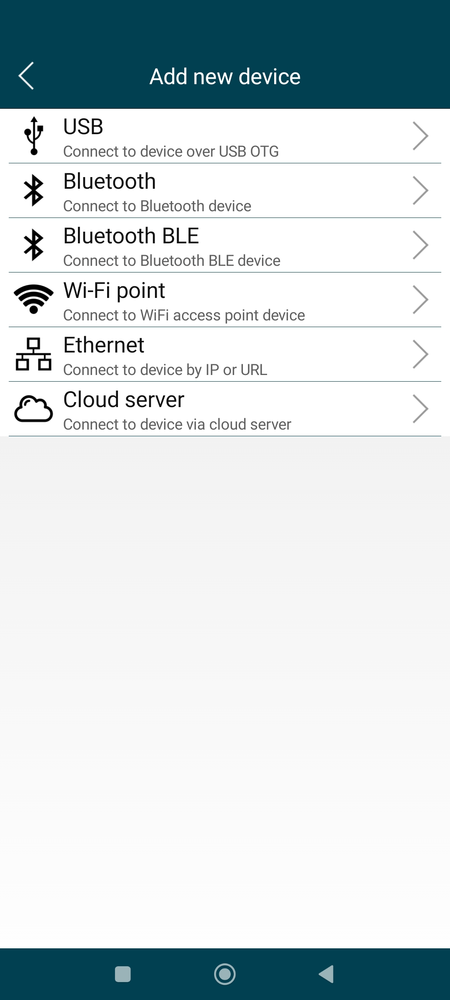

Gib die IP Adresse aus dem vorherigen Schritt ein

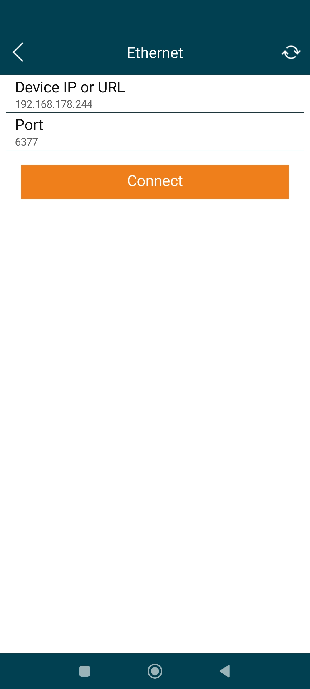

Klicke auf `Connect`

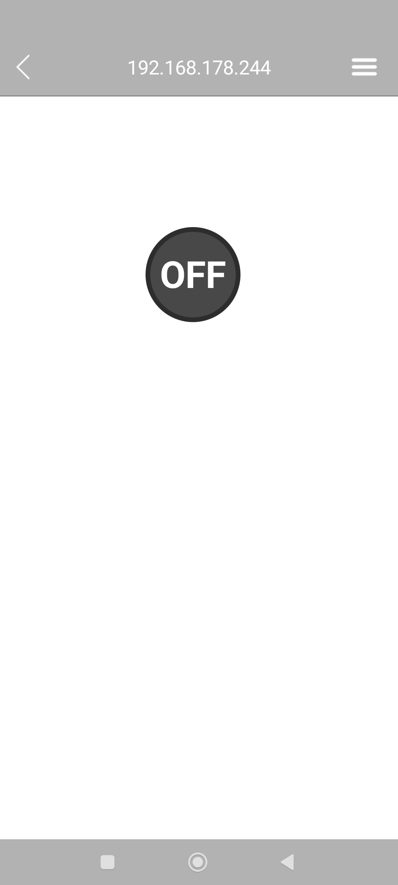

Jetzt drückt auf den Button und hoffentlich gehen die Lichter an!

# Und jetzt?

* Versucht doch einmal die Steuerung über Bluetooth und nicht WiFi (Tipp: Das [Steuerungs Projekt](../Steuerung/README.md) nutzt WiFi)
* Schließt andere Sensoren (z.B. Ultraschall) an und lasst euch den Status in der GUI anzeigen
* Erweitert den Code mit eigenen Ideen