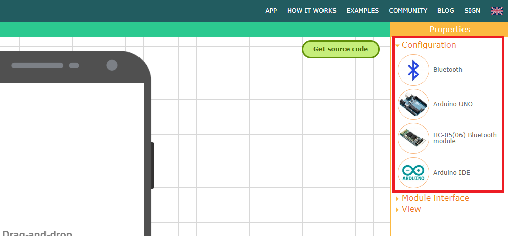
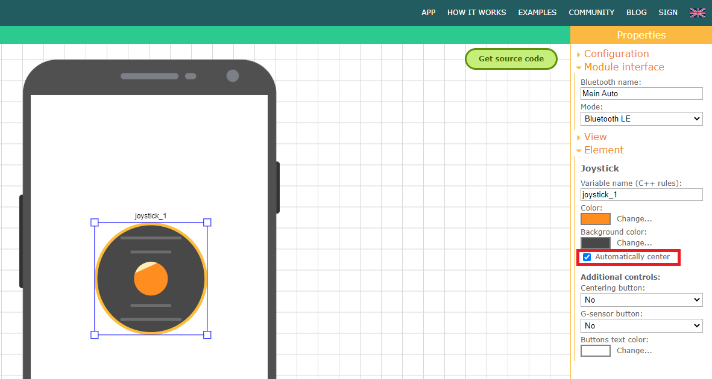
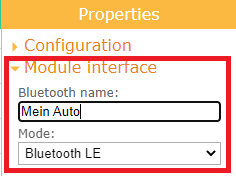

# Bluetooth BLE Fernsteuerung mit RemoteXY

## Voraussetzung

RemoteXY muss eingerichtet sein. Eine Anleitung dazu findet ihr [hier](../README.md)

## Projekt erstellen

### GUI mit RemoteXY erstellen

1. Folge diesem [Link](https://remotexy.com/en/editor/) und klicke oben recht kannst du auf `Editor`.

    

2. Rechts bei `Properties` öffne `Configuration`: 

    

    Wähle eins der Elemente an und es wird ein Pop-up erscheinen. Wähle die Verbindung, Board und Modul wie unten aufgelistet und bestätige deine Auswahl:

      * Connection: Bluetooth
      * Board: ESP32 based board
      * Module: Bluetooth on chip
      * IDE: Arduino IDE
    
    <br />
    

3. Auf der linken Seite bei `Elements` klappe `Controls` auf und ziehe einen Joystick in die GUI. 

    

    Anschließend, klicke den Joystick in der GUI an und rechts bei `Properties` bei `Element` wirst du sehen, dass er nun `joystick_1` heißt. 
  
    In dieser Übersicht weiter unten, setze einen Haken bei `automatically center`.

    

4. Bleibe rechts und öffne den Punkt `Module Interface`. 

    Ändere nun den Namen deines Autos bei `Bluetooth name`:

    

5. Jetzt können wir mit `Get Code` den Quellcode holen. Er wird unten dargestellt. 

    Wir können im offenen Arduino Studio den Text einfach in eine neue Datei kopieren.

    

    

### Steuercode für unser Auto

Zuerst müssen wir ein paar Sachen definieren die wir später verwenden wollen:

Vorher
```C++
/////////////////////////////////////////////
//           END RemoteXY include          //
/////////////////////////////////////////////
```

Nachher
```C++
/////////////////////////////////////////////
//           END RemoteXY include          //
/////////////////////////////////////////////

// Definitionen für unser Auto
#include "ESP32Servo.h"
#define DIRECTION_PIN 12    // Servo für die Lenkung
#define SPEED_PIN 13        // Motor Treiber Pin ENB
#define MOTOR_1_PIN_1 32    // Motor Treiber Pin IN3
#define MOTOR_1_PIN_2 33    // Motor Treiber Pin IN4
Servo lenkungsServo;
```

Danach müssen wir unsere die Methode `setup` anpassen, damit wir einen definierten Zustand beim Start des ESP32 haben und die Pins richtig konfiguriert sind.

Vorher
```C++
void setup() 
{
  RemoteXY_Init (); 
}
```

Nachher
```C++
void setup() 
{
  RemoteXY_Init (); 
  Serial.begin(9600);

  // Pins am ESP32 Modul auf OUTPUT = Ausgang setzen
  pinMode(MOTOR_1_PIN_1, OUTPUT);
  pinMode(MOTOR_1_PIN_2, OUTPUT);
  pinMode(SPEED_PIN, OUTPUT);

  // Ansteuerung des Servos für die Lenkung ist etwas komplizierter
  ESP32PWM::allocateTimer(0);
  lenkungsServo.setPeriodHertz(50);
  lenkungsServo.attach(DIRECTION_PIN, 500, 2400);

  // Lenkung auf Mittelstellung
  lenkungsServo.write(0);
  // Motor aus
  digitalWrite(MOTOR_1_PIN_1, LOW);
  digitalWrite(MOTOR_1_PIN_2, LOW); 
}
```

In der Methode `loop` rufen wir eine Methode `drive` auf. Diese bekommt den aktuellen Wert vom Joystick und steuert dann den Motor und den Servo an.

Dafür definieren wir zuerst die Methode `drive` und fügen diese **vor** der Methode `setup` in unseren Code ein.

```C++
/**
 * Funktion setzt die Parameter für Vorwärts / Rückwärts und Lenkung
 * 
 **/
void drive(int8_t x, int8_t y) {
  
  // === VORWÄRTS / RÜCKWÄRTS ===

  // y - Also "hoch" und "runter" im Joystick get von -100 bis +100 
  // > 0 vorwärts
  // < 0 rückwärts
  // 0 stop
  if (y > 0) {
    // Vorwärts
    digitalWrite(MOTOR_1_PIN_1, HIGH);
    digitalWrite(MOTOR_1_PIN_2, LOW);
  } else if (y < 0) {
    // Rückwärts
    digitalWrite(MOTOR_1_PIN_1, LOW);
    digitalWrite(MOTOR_1_PIN_2, HIGH);    
  } else {
    // Stop
    digitalWrite(MOTOR_1_PIN_1, LOW);
    digitalWrite(MOTOR_1_PIN_2, LOW);
    analogWrite(SPEED_PIN, 0); 
  }

  // === GESCHWINDIGKEIT ===

  // Der Motor kann eine Geschwindigkeit von 0 bis 255
  // Bis zu einem Wert von ca 50 pfeift der Motor nur und hat nicht genügend Kraft das Auto anzutreiben
  // Der Joystick liefert Werte von 0 bis 100 oder von 0 bis -100
  // Deswegen müssen wir die Geschwindigkeit umrechnen

  if (y != 0) {
    // + und - behandeln wir gleich, wir wollen nur einen Wert von 0 -100 - https://www.arduino.cc/reference/de/language/functions/math/abs/
    int geschwindigkeit_positiv = abs(y);
    int geschwindigkeit = map(geschwindigkeit_positiv, 0, 100, 100, 255);
    // - Wir 'mappen' den Wertebreeich 0 bis 100 auf einen Wertebereich von 50 bis 255 - https://www.arduino.cc/reference/de/language/functions/math/map/
    // - mit analogWrite schreiben geben wir den Wert dann am Pin aus
    analogWrite(SPEED_PIN, geschwindigkeit); 
  }
  // === LENKUNG ===

  // x - also Joystick links oder rechts müssen wir wieder mappen

  // wir mappen auf 10° bis 170° weil der Servo sonst am Gehäuse anschlägt
  int lenkung = map(x, -100, 100, 10, 170); 
  lenkungsServo.write(lenkung);

  Serial.print(x);
  Serial.print(",");
  Serial.print(y);
  Serial.print(",");
  Serial.print(geschwindigkeit);
  Serial.print(",");
  Serial.print(lenkung);
}
```

Der Aufruf für unsere `drive` Methode muss dann noch in die Methode `loop`

Vorher:
```C++
void loop() 
{ 
  RemoteXY_Handler ();  
  // TODO you loop code
  // use the RemoteXY structure for data transfer
  // do not call delay() 
}
```

Nachher:
```C++
void loop() 
{ 
  RemoteXY_Handler ();  
  drive(RemoteXY.joystick_1_x, RemoteXY.joystick_1_y);
}
```

Jetzt bitte kompilieren und auf den ESP übertragen.
Klick auf Button `Upload` und wenn eine Meldung `Connecting....` kommt, den Knopf rechts vom USB Anschluss auf dem ESP drücken, bis die Übertragung beginnt.

## Fahren!!!!

Auf dem Handy die App `RemoteXY` öffnen. Oben auf `+` und dann `Bluetooth BLE` aussuchen. Dann in der Liste das Auto nach dem Namen suchen den ihr vorher festgelegt habt.

Die Steuerung öffnet sich dann und es heißt. `Gentlegirls, please start your engines`

## Fehlersuche

* Auch ohne angeschlossenen Motor kann man den Serial Plotter `Tools > Serial Plotter` nutzen. Er zeigt X/Y, Geschwindigkeit und Lenkung grafisch dar.
* Sollte die Bluetooth Verbindung abbrechen und nicht mehr hergestellt werden können hilft das Bluetooth kurz abschalten und wieder einschalten.

## Und jetzt?

* Versucht doch einmal die Steuerung über Wifi und nicht Bluetooth (Tipp: Das [LED Projekt](../LED/README.md) nutzt WiFi)
* Schließt andere Sensoren (z.B. Ultraschall) an und lasst euch den Status in der GUI anzeigen
* Erweitert den Code mit eigenen Ideen